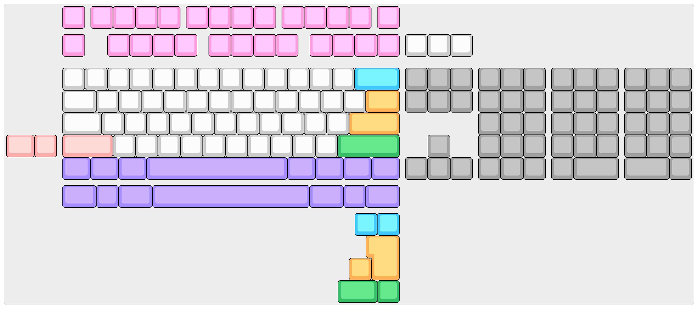

# Acheron Athena

## Introduction

Athena is a tenkeyless (TKL) keyboard Printed Circuit Board (PCB) which main feature is the multi-layout support. In its latest version, release Gamma, Athena supports:

- 87 (F12) or 88 (F13) TKL function rows;
- ANSI and ISO layouts
- 7U and 6.25U spacebar bottom row layouts
- Split backspace
- Split right shift
- "TK" layout with a numpad-like section for the navcluster, including alternatives with 2-unit keys.

Below is a [Keyboard Layout Editor](http://keyboard-layout-editor.com/) image of the layouts Athena supports. The KLE JSON file for this image is stored in the `resources` folder.

The Acheron line of TKL PCBs (Apollo, Athena and Themis) were designed to be "universal" TKL PCBs, that is, designed to fit a wide variety of custom mechanical keyboards, mainly based on the B87 PCB originally sold by the [winkey.kr store](https://winkeyless.kr/product/b-87-pcb-x2/). The compatibility list is being built as more people check and test. See the **Keyboard compatibility** section of this README for the list of keyboards compatible with the Athena.

## Features

Beyond its varied layout support and compatibility with a myriad of TKL PCBs, Athena also features:

- In-switch lighting through single-color LED diodes;
- Some of the in-switch LEDs work as indicators for Caps Lock, Num Lock and Scroll Lock. This functionality can be turned off in VIA, making the LEDs work as non-indicative LEDs;
- RGB underglow (turned off by default);
- Removable USB-C connector with support for the JST SM04B-SRSS connector;

## Technical information

- Layout size: tenkeykess (TKL)
- Compatible switches: MX-like only, solderable
- Lighting: single colors per-key through-hole LEDs, RGB underglow
- Microcontroller: STM32 family (see [the Joker topology documentation](https://acheronproject.com/joker_mcus/joker/)), originally intended for STM32F401RCT6;
- Connector: detachable USB Type C on the top side and JST connector for daughterboard support
- Firmware compatibility: QMK (with VIA support)
- Protection hardware:
  * USB data lines and power rail ESD suppressing
  * USB power overvoltage protection
  * Enclosure grounding pad
  * Overcurrent protection
  * LDO crowbar diode
  * EMI suppression (shielding ferrite bead)
  * Inrush current protection
- Current release: release Gamma-RC1
- Designer: Gondolindrim
- License: Acheron Open-Source Hardware License version 1.4

## Keyboard compatibility

## Known compatibilities

- **Geonworks F1-8X and F1-6X:** confirmed by Geon, who tested the PCB 3D files against the case 3D files. Live hardware testing into a machined case is pending.
- **Geonworks Frog TKL** and its "K" variant;

### Known incompatibilities

- **ai03 KBD8X MKII**: ai03 open-sourced the PCB files for his KBD8X. Alghtough Apollo's edges do fit inside the original PCB's, its connector is more protruded then the original PCB's.

- **PrismA18**: different layouts on the function row.

## Acknowledgements

- Geon, who kindly spent time helping design this PCB to fit his keyboards.

## Copyright notice

This project is released under the Acheron Open-Hardware License V1.3. For the license, please refer to the LICENCE.md file.

The "athena with shield" logo was licensed through Adobe Stock in [this link](https://stock.adobe.com/hu/images/greek-goddess-athena-illustration/157297137); the source file in Adobe Illustrator format, with a converted ``.svg`` format  can be found in ``./resources/athena_logo``. The license was obtained in may 06, 2021 and allows the AcheronProject to redistribute the logo as open-source and allows anyone to sell the PCBs commercially, but it does not allow for reproduction, meaning that if you want to use the logo for your designs or products you will have to buy a license yourself.
